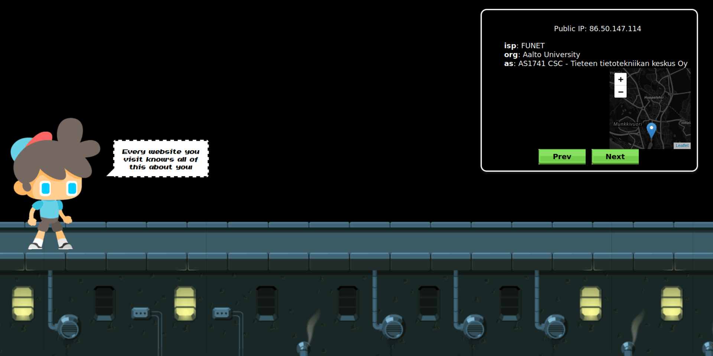
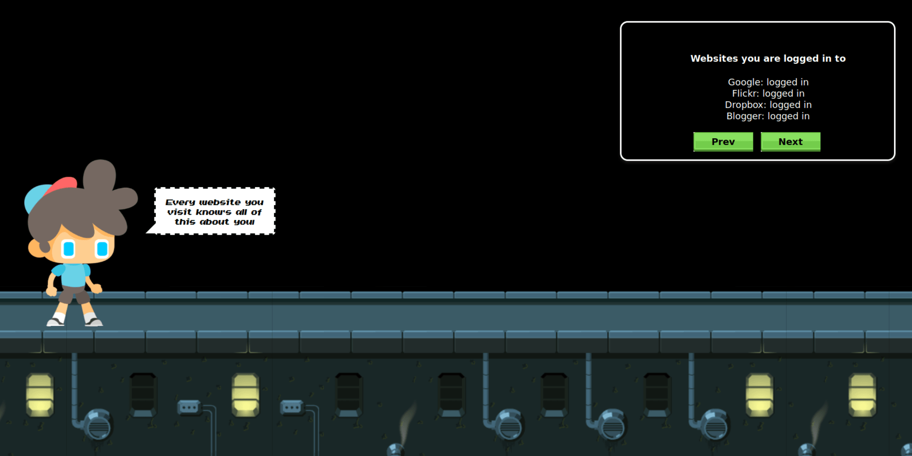
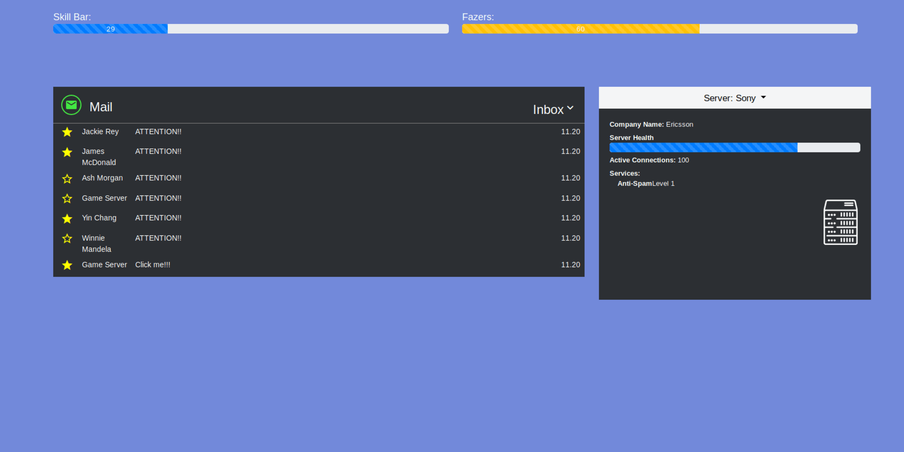

 

<h3 align="center">Let us Hack you so no one else can.</h3>

 

-----------------------------------------------------------------------

## Description

* WebSafe is a children's game that helps the users of any age know about the different types of cyber threats in a light and fun environment.
* The game could be played by every budding kid who wants to secure themselves before stepping into the online world.

--------------------------------------

### Game Modes
* The game begins with the user getting introduced to our gameplay and what exactly is the purpose of the game.
* It moves on to the single-player mode where the player encounters various types of situations and depending on the responses to those, they acquires points.
* Once the player acquires enough points which prove the understanding they have regarding the attacks, it will move on to the multiplayer mode(In designing phase). 

#### Add-ons

- [ ] The multiplayer mode.
- [ ] Incorporating different cyber attacks for teaching purposes.

----------------------------------------

## Problem tackled
- phishing, fake messages, unwanted permissions, surveillance, etc are the various cyber-attacks that one sees on a daily basis.
- With the younger generations moving faster and getting exposed to the various cyber-attacks before they can comprehend leads to a lot of them falling for them.
- Our game ensures their understanding and knowledge about various attacks and allows to them make wiser choices while surfing the web.

## Demo

##### Screenshots

  

  

  

------------------------------------------
### Note

 This project was done under `30 hours with minimal pre-preparation`

------------------------------------------
### Contributors

- [@hetzz](https://github.com/hetzz)
- [@Rusherrg](https://github.com/RusherRG)
- [@akshay-99](https://github.com/akshay-99)
- [@Korusuke](https://github.com/Korusuke)

------------------------------------------

### Track, Challenge

> Secure the Future, Security Awareness for Kids (Ericsson)

This repository / project was a part of Junction 2019 hackathon held at Espoo, Finland.
